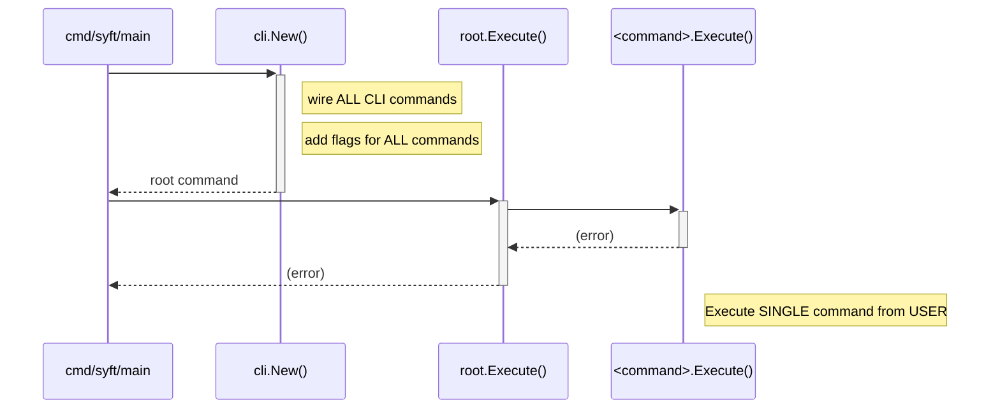
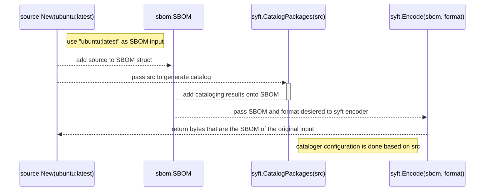

# Developing

## Getting started

In order to test and develop in this repo you will need the following dependencies installed:
- Golang
- docker
- make
- Python (>= 3.9)

### Docker settings for getting started
Make sure you've updated your docker settings so the default docker socket path is available.

Go to:

docker -> settings -> advanced

Make sure:

```
Allow the default Docker socket to be used
```

is checked.

Also double check that the docker context being used is the default context. If it is not, run:

`docker context use default`

After cloning the following step can help you get setup:
1. run `make bootstrap` to download go mod dependencies, create the `/.tmp` dir, and download helper utilities.
2. run `make` to view the selection of developer commands in the Makefile
3. run `make build` to build the release snapshot binaries and packages
4. for an even quicker start you can run `go run cmd/syft/main.go` to print the syft help.
	- this command `go run cmd/syft/main.go alpine:latest` will compile and run syft against `alpine:latest`
5. view the README or syft help output for more output options

The main make tasks for common static analysis and testing are `lint`, `format`, `lint-fix`, `unit`, `integration`, and `cli`.

See `make help` for all the current make tasks.

### Internal Artifactory Settings

**Not always applicable**

Some companies have Artifactory setup internally as a solution for sourcing secure dependencies.
If you're seeing an issue where the unit tests won't run because of the below error then this section might be relevant for your use case.

```
[ERROR] [ERROR] Some problems were encountered while processing the POMs
```

If you're dealing with an issue where the unit tests will not pull/build certain java fixtures check some of these settings:

- a `settings.xml` file should be available to help you communicate with your internal artifactory deployment
- this can be moved to `syft/pkg/cataloger/java/test-fixtures/java-builds/example-jenkins-plugin/` to help build the unit test-fixtures
- you'll also want to modify the `build-example-jenkins-plugin.sh` to use `settings.xml`

For more information on this setup and troubleshooting see [issue 1895](https://github.com/anchore/syft/issues/1895#issuecomment-1610085319)


## Architecture

At a high level, this is the package structure of syft:
```
./cmd/syft/
│   ├── cli/
│   │   ├── cli.go          // where all commands are wired up
│   │   ├── commands/       // all command implementations
│   │   ├── options/        // all command flags and configuration options
│   │   └── ui/             // all handlers for events that are shown on the UI
│   └── main.go             // entrypoint for the application
└── syft/                   // the "core" syft library
    ├── format/             // contains code to encode or decode to and from SBOM formats
    ├── pkg/                // contains code to catalog packages from a source
    ├── sbom/               // contains the definition of an SBOM
    └── source/             // contains code to create a source object for some input type (e.g. container image, directory, etc)
```

Syft's core library is implemented in the `syft` package and subpackages, where the major packages are:

- the `syft/source` package produces a `source.Source` object that can be used to catalog a directory, container, and other source types.
- the `syft` package contains a single function that can take a `source.Source` object and catalog it, producing an `sbom.SBOM` object
- the `syft/format` package contains the ability to encode and decode SBOMs to and from different SBOM formats (such as SPDX and CycloneDX)

The `cmd` package at the highest level execution flow wires up [`spf13/cobra`](https://github.com/spf13/cobra) commands for execution in the main application:


The `packages` command uses the core library to generate an SBOM for the given user input:


Additionally, here is a [gist of using syft as a library](https://gist.github.com/spiffcs/3027638b7ba904d07e482a712bc00d3d) to generate a SBOM for a docker image.


### `pkg.Package` object

The `pkg.Package` object is a core data structure that represents a software package. Fields like `name` and `version` probably don't need
a detailed explanation, but some of the other fields are worth a quick overview:

- `FoundBy`: the name of the cataloger that discovered this package (e.g. `python-pip-cataloger`).
- `Locations`: these are the set of paths and layer ids that were parsed to discover this package (e.g. `python-pip-cataloger`).
- `Language`: the language of the package (e.g. `python`).
- `Type`: this is a high-level categorization of the ecosystem the package resides in. For instance, even if the package is a egg, wheel, or requirements.txt reference, it is still logically a "python" package. Not all package types align with a language (e.g. `rpm`) but it is common.
- `Metadata`: specialized data for specific location(s) parsed. We should try and raise up as much raw information that seems useful. As a rule of thumb the object here should be as flat as possible and use the raw names and values from the underlying source material parsed.

When `pkg.Package` is serialized an additional `MetadataType` is shown. This is a label that helps consumers understand the datashape of the `Metadata` field.

By convention the `MetadataType` value should follow these rules of thumb:

- Only use lowercase letters, numbers, and hyphens. Use hyphens to separate words.
- **Try to anchor the name in the ecosystem, language, or packaging tooling it belongs to**. For a package manager for a language ecosystem the language, framework or runtime should be used as a prefix. For instance `pubspec-lock` is an OK name, but `dart-pubspec-lock` is better. For an OS package manager this is not necessary (e.g. `apk-db-entry` is a good name, but `alpine-apk-db-entry` is not since `alpine` and the `a` in `apk` is redundant).
- **Be as specific as possible to what the data represents**. For instance `ruby-gem` is NOT a good `MetadataType` value, but `ruby-gemspec` is. Why? Ruby gem information can come from a gemspec file or a Gemfile.lock, which are very different. The latter name provides more context as to what to expect.
- **Should describe WHAT the data is, NOT HOW it's used**. For instance `r-description-installed-file` is NOT a good `MetadataType` value since it's trying to convey that we use the DESCRIPTION file in the R ecosystem to detect installed packages. Instead simply describe what the DESCRIPTION file is itself without context of how it's used: `r-description`.
- **Use the `lock` suffix** to distinct between manifest files that loosely describe package version requirements vs files that strongly specify one and only one version of a package ("lock" files). These should only be used with respect to package managers that have the guide and lock distinction, but would not be appropriate otherwise (e.g. `rpm` does not have a guide vs lock, so `lock` should NOT be used to describe a db entry).
- **Use the `archive` suffix to indicate a package archive** (e.g. rpm file, apk file, etc) that describes the contents of the package. For example an RPM file that was cataloged would have a `rpm-archive` metadata type (not to be confused with an RPM DB record entry which would be `rpm-db-entry`).
- **Use the `entry` suffix** to indicate information about a package that was found as a single entry within file that has multiple package entries. If the entry was found within a DB or a flat-file store for an OS package manager, you should use `db-entry`.
- **Should NOT contain the phrase `package`**, though exceptions are allowed (say if the canonical name literally has the phrase package in it).
- **Should NOT contain have a `file` suffix** unless the canonical name has the term "file", such as a `pipfile` or `gemfile`. An example of a bad name for this rule is`ruby-gemspec-file`; a better name would be `ruby-gemspec`.
- **Should NOT contain the exact filename+extensions**. For instance `pipfile.lock` shouldn't really be in the name, instead try and describe what the file is: `python-pipfile-lock` (but shouldn't this be `python-pip-lock` you might ask? No, since the `pip` package manger is not related to the `pipfile` project).
- **Should NOT contain the phrase `metadata`**, unless the canonical name has this term.
- **Should represent a single use case**. For example, trying to describe Hackage metadata with a single `HackageMetadata` struct (and thus `MetadataType`) is not allowed since it represents 3 mutually exclusive use cases: representing a `stack.yaml`, `stack.lock`, or `cabal.project` file. Instead, each of these should have their own struct types and `MetadataType` values.

There are other cases that are not covered by these rules... and that's ok! The goal is to provide a consistent naming scheme that is easy to understand and use when it's applicable. If the rules do not exactly apply in your situation then just use your best judgement (or amend these rules as needed whe new common cases come up).

What if the underlying parsed data represents multiple files? There are two approaches to this:
- use the primary file to represent all the data. For instance, though the `dpkg-cataloger` looks at multiple files to get all information about a package, it's the `status` file that gets represented.
- nest each individual file's data under the `Metadata` field. For instance, the `java-archive-cataloger` may find information from on or all of the files: `pom.xml`, `pom.properties`, and `MANIFEST.MF`. However, the metadata is simply `java-metadata' with each possibility as a nested optional field.

### Syft Catalogers

Catalogers are the way in which syft is able to identify and construct packages given a set a targeted list of files.
For example, a cataloger can ask syft for all `package-lock.json` files in order to parse and raise up javascript packages 
(see [how file globs](https://github.com/anchore/syft/tree/v0.70.0/syft/pkg/cataloger/javascript/cataloger.go#L16-L21) and
[file parser functions](https://github.com/anchore/syft/tree/v0.70.0/syft/pkg/cataloger/javascript/cataloger.go#L16-L21) are used 
for a quick example).

From a high level catalogers have the following properties:

- _They are independent from one another_. The java cataloger has no idea of the processes, assumptions, or results of the python cataloger, for example.

- _They do not know what source is being analyzed_. Are we analyzing a local directory? an image? if so, the squashed representation or all layers? The catalogers do not know the answers to these questions. Only that there is an interface to query for file paths and contents from an underlying "source" being scanned.

- _Packages created by the cataloger should not be mutated after they are created_. There is one exception made for adding CPEs to a package after the cataloging phase, but that will most likely be moved back into the cataloger in the future.


Cataloger names should be unique and named with the following rules of thumb in mind:

- Must end with `-cataloger`
- Use lowercase letters, numbers, and hyphens only
- Use hyphens to separate words
- Catalogers for language ecosystems should start with the language name (e.g. `python-` for a cataloger that raises up python packages)
- Distinct between when the cataloger is searching for evidence of installed packages vs declared packages. For example, there are currently two different gemspec-based catalogers, the `ruby-gemspec-cataloger` and `ruby-installed-gemspec-cataloger`, where the latter requires that the gemspec is found within a `specifications` directory (which means it was installed, not just at the root of a source repo).

#### Building a new Cataloger

Catalogers must fulfill the [`pkg.Cataloger` interface](https://github.com/anchore/syft/tree/v0.70.0/syft/pkg/cataloger.go) in order to add packages to the SBOM.
All catalogers should be added to:
- the [global list of catalogers](https://github.com/anchore/syft/blob/9995950c70e849f9921919faffbfcf46401f71f3/syft/pkg/cataloger/cataloger.go#L92-L125)
- at least one source-specific list, today the two lists are [directory catalogers and image catalogers](https://github.com/anchore/syft/blob/9995950c70e849f9921919faffbfcf46401f71f3/syft/pkg/cataloger/cataloger.go#L39-L89)

For reference, catalogers are [invoked within syft](https://github.com/anchore/syft/tree/v0.70.0/syft/pkg/cataloger/catalog.go#L41-L100) one after the other, and can be invoked in parallel.

`generic.NewCataloger` is an abstraction syft used to make writing common components easier (see the [apkdb cataloger](https://github.com/anchore/syft/tree/v0.70.0/syft/pkg/cataloger/apkdb/cataloger.go) for example usage). 
It takes the following information as input:
- A `catalogerName` to identify the cataloger uniquely among all other catalogers.
- Pairs of file globs as well as parser functions to parse those files. These parser functions return a slice of [`pkg.Package`](https://github.com/anchore/syft/blob/9995950c70e849f9921919faffbfcf46401f71f3/syft/pkg/package.go#L19) as well as a slice of [`artifact.Relationship`](https://github.com/anchore/syft/blob/9995950c70e849f9921919faffbfcf46401f71f3/syft/artifact/relationship.go#L31) to describe how the returned packages are related. See this [the apkdb cataloger parser function](https://github.com/anchore/syft/tree/v0.70.0/syft/pkg/cataloger/apkdb/parse_apk_db.go#L22-L102) as an example.

Identified packages share a common `pkg.Package` struct so be sure that when the new cataloger is constructing a new package it is using the [`Package` struct](https://github.com/anchore/syft/tree/v0.70.0/syft/pkg/package.go#L16-L31).
If you want to return more information than what is available on the `pkg.Package` struct then you can do so in the `pkg.Package.Metadata` section of the struct, which is unique for each [`pkg.Type`](https://github.com/anchore/syft/blob/v0.70.0/syft/pkg/type.go).
See [the `pkg` package](https://github.com/anchore/syft/tree/v0.70.0/syft/pkg) for examples of the different metadata types that are supported today. 
These are plugged into the `MetadataType` and `Metadata` fields in the above struct. `MetadataType` informs which type is being used. `Metadata` is an interface converted to that type.

Finally, here is an example of where the package construction is done within the apk cataloger:
- [Calling the APK package constructor from the parser function](https://github.com/anchore/syft/blob/v0.70.0/syft/pkg/cataloger/apkdb/parse_apk_db.go#L106)
- [The APK package constructor itself](https://github.com/anchore/syft/tree/v0.70.0/syft/pkg/cataloger/apkdb/package.go#L12-L27)

Interested in building a new cataloger? Checkout the [list of issues with the `new-cataloger` label](https://github.com/anchore/syft/issues?q=is%3Aopen+is%3Aissue+label%3Anew-cataloger+no%3Aassignee)!
If you have questions about implementing a cataloger feel free to file an issue or reach out to us [on discourse](https://anchore.com/discourse)!


#### Searching for files

All catalogers are provided an instance of the [`file.Resolver`](https://github.com/anchore/syft/blob/v0.70.0/syft/source/file_resolver.go#L8) to interface with the image and search for files. The implementations for these 
abstractions leverage [`stereoscope`](https://github.com/anchore/stereoscope) in order to perform searching. Here is a 
rough outline how that works:

1. a stereoscope `file.Index` is searched based on the input given (a path, glob, or MIME type). The index is relatively fast to search, but requires results to be filtered down to the files that exist in the specific layer(s) of interest. This is done automatically by the `filetree.Searcher` abstraction. This abstraction will fallback to searching directly against the raw `filetree.FileTree` if the index does not contain the file(s) of interest. Note: the `filetree.Searcher` is used by the `file.Resolver` abstraction.
2. Once the set of files are returned from the `filetree.Searcher` the results are filtered down further to return the most unique file results. For example, you may have requested for files by a glob that returns multiple results. These results are filtered down to deduplicate by real files, so if a result contains two references to the same file, say one accessed via symlink and one accessed via the real path, then the real path reference is returned and the symlink reference is filtered out. If both were accessed by symlink then the first (by lexical order) is returned. This is done automatically by the `file.Resolver` abstraction.
3. By the time results reach the `pkg.Cataloger` you are guaranteed to have a set of unique files that exist in the layer(s) of interest (relative to what the resolver supports).

## Testing

### Levels of testing

- `unit`: The default level of test which is distributed throughout the repo are unit tests. Any `_test.go` file that 
  does not reside somewhere within the `/test` directory is a unit test. Other forms of testing should be organized in 
  the `/test` directory. These tests should focus on correctness of functionality in depth. % test coverage metrics 
  only considers unit tests and no other forms of testing.

- `integration`: located within `cmd/syft/internal/test/integration`, these tests focus on the behavior surfaced by the common library 
  entrypoints from the `syft` package and make light assertions about the results surfaced. Additionally, these tests
  tend to make diversity assertions for enum-like objects, ensuring that as enum values are added to a definition
  that integration tests will automatically fail if no test attempts to use that enum value. For more details see 
  the "Data diversity and freshness assertions" section below.

- `cli`: located with in `test/cli`, these are tests that test the correctness of application behavior from a 
  snapshot build. This should be used in cases where a unit or integration test will not do or if you are looking
  for in-depth testing of code in the `cmd/` package (such as testing the proper behavior of application configuration,
  CLI switches, and glue code before syft library calls).

- `acceptance`: located within `test/compare` and `test/install`, these are smoke-like tests that ensure that application  
  packaging and installation works as expected. For example, during release we provide RPM packages as a download 
  artifact. We also have an accompanying RPM acceptance test that installs the RPM from a snapshot build and ensures the 
  output of a syft invocation matches canned expected output. New acceptance tests should be added for each release artifact
  and architecture supported (when possible).

### Data diversity and freshness assertions

It is important that tests against the codebase are flexible enough to begin failing when they do not cover "enough"
of the objects under test. "Cover" in this case does not mean that some percentage of the code has been executed 
during testing, but instead that there is enough diversity of data input reflected in testing relative to the
definitions available.

For instance, consider an enum-like value like so:
```go
type Language string

const (
  Java            Language = "java"
  JavaScript      Language = "javascript"
  Python          Language = "python"
  Ruby            Language = "ruby"
  Go              Language = "go"
)
```

Say we have a test that exercises all the languages defined today:

```go
func TestCatalogPackages(t *testing.T) {
  testTable := []struct {
    // ... the set of test cases that test all languages
  }
  for _, test := range cases {
    t.Run(test.name, func (t *testing.T) {
      // use inputFixturePath and assert that syft.CatalogPackages() returns the set of expected Package objects
      // ...
    })
  }
}
```

Where each test case has a `inputFixturePath` that would result with packages from each language. This test is
brittle since it does not assert that all languages were exercised directly and future modifications (such as 
adding a new language) won't be covered by any test cases.

To address this the enum-like object should have a definition of all objects that can be used in testing:

```go
type Language string

// const( Java Language = ..., ... )

var AllLanguages = []Language{
	Java,
	JavaScript,
	Python,
	Ruby,
	Go,
	Rust,
}
```

Allowing testing to automatically fail when adding a new language:

```go
func TestCatalogPackages(t *testing.T) {
  testTable := []struct {
  	// ... the set of test cases that (hopefully) covers all languages
  }

  // new stuff...
  observedLanguages := strset.New()
  
  for _, test := range cases {
    t.Run(test.name, func (t *testing.T) {
      // use inputFixturePath and assert that syft.CatalogPackages() returns the set of expected Package objects
    	// ...
    	
    	// new stuff...
    	for _, actualPkg := range actual {
        observedLanguages.Add(string(actualPkg.Language))
    	}
    	
    })
  }

   // new stuff...
  for _, expectedLanguage := range pkg.AllLanguages {
    if 	!observedLanguages.Contains(expectedLanguage) {
      t.Errorf("failed to test language=%q", expectedLanguage)	
    }
  }
}
```

This is a better test since it will fail when someone adds a new language but fails to write a test case that should
exercise that new language. This method is ideal for integration-level testing, where testing correctness in depth 
is not needed (that is what unit tests are for) but instead testing in breadth to ensure that units are well integrated.

A similar case can be made for data freshness; if the quality of the results will be diminished if the input data
is not kept up to date then a test should be written (when possible) to assert any input data is not stale.

An example of this is the static list of licenses that is stored in `internal/spdxlicense` for use by the SPDX 
presenters. This list is updated and published periodically by an external group and syft can grab and update this
list by running `go generate ./...` from the root of the repo.

An integration test has been written to grabs the latest license list version externally and compares that version
with the version generated in the codebase. If they differ, the test fails, indicating to someone that there is an
action needed to update it.

**_The key takeaway is to try and write tests that fail when data assumptions change and not just when code changes.**_

### Snapshot tests

The format objects make a lot of use of "snapshot" testing, where you save the expected output bytes from a call into the
git repository and during testing make a comparison of the actual bytes from the subject under test with the golden
copy saved in the repo. The "golden" files are stored in the `test-fixtures/snapshot` directory relative to the go 
package under test and should always be updated by invoking `go test` on the specific test file with a specific CLI 
update flag provided.

Many of the `Format` tests make use of this approach, where the raw SBOM report is saved in the repo and the test 
compares that SBOM with what is generated from the latest presenter code. For instance, at the time of this writing 
the CycloneDX presenter snapshots can be updated by running:

```bash
go test ./internal/formats -update-cyclonedx
```

These flags are defined at the top of the test files that have tests that use the snapshot files.

Snapshot testing is only as good as the manual verification of the golden snapshot file saved to the repo! Be careful 
and diligent when updating these files.


