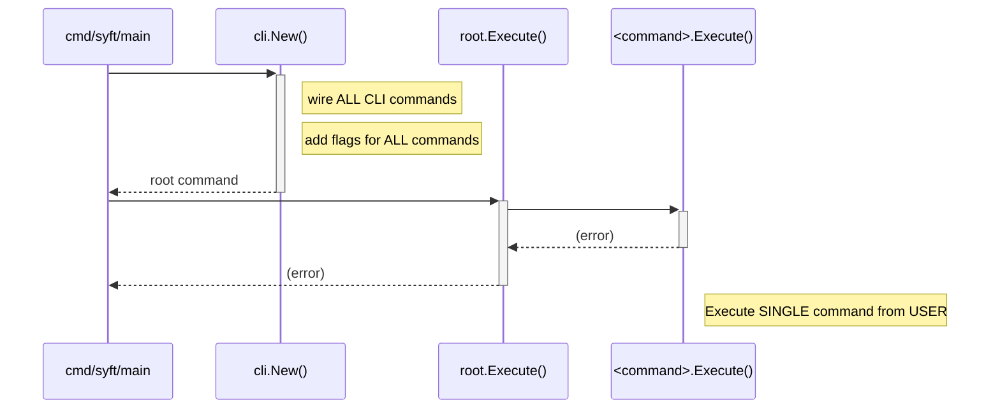
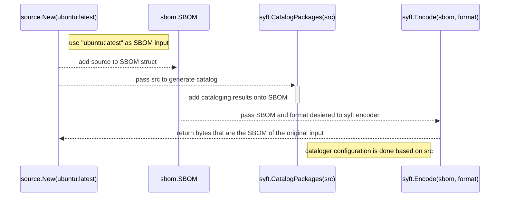

# Developing

## Getting started

In order to test and develop in this repo you will need the following dependencies installed:
- Golang
- docker
- make

After cloning the following step can help you get setup:
1. run `make bootstrap` to download go mod dependencies, create the `/.tmp` dir, and download helper utilities.
2. run `make` to view the selection of developer commands in the Makefile
3. run `make build` to build the release snapshot binaries and packages
4. for an even quicker start you can run `go run cmd/syft/main.go` to print the syft help.
	- this command `go run cmd/syft/main.go alpine:latest` will compile and run syft against `alpine:latest`
5. view the README or syft help output for more output options

#### Make output
The main make tasks for common static analysis and testing are `lint`, `lint-fix`, `unit`, `integration`, and `cli`.
```
all                      Run all linux-based checks (linting, license check, unit, integration, and linux compare tests)
benchmark                Run benchmark tests and compare against the baseline (if available)
bootstrap                Download and install all tooling dependencies (+ prep tooling in the ./tmp dir)
build                    Build release snapshot binaries and packages
check-licenses           Ensure transitive dependencies are compliant with the current license policy
clean-test-image-cache   Clean test image cache
clean                    Remove previous builds, result reports, and test cache
cli                      Run CLI tests
compare-linux            Run compare tests on build snapshot binaries and packages (Linux)
compare-mac              Run compare tests on build snapshot binaries and packages (Mac)
generate-json-schema     Generate a new json schema
generate-license-list    Generate an updated spdx license list
help                     Display this help
integration              Run integration tests
lint-fix                 Auto-format all source code + run golangci lint fixers
lint                     Run gofmt + golangci lint checks
show-test-image-cache    Show all docker and image tar cache
show-test-snapshots      Show all test snapshots
snapshot-with-signing    Build snapshot release binaries and packages (with dummy signing)
test                     Run all tests (currently unit, integration, linux compare, and cli tests)
unit                     Run unit tests (with coverage)
```

## Architecture

Syft is used to generate a Software Bill of Materials (SBOM) from different kinds of input.

### Code organization for the cmd package
Syft's entrypoint can be found in the `cmd` package at `cmd/syft/main.go`. `main.go` builds a new syft `cli` via `cli.New()` 
and then executes the `cli` via `cli.Execute()`. The `cli` package is responsible for parsing command line arguments, 
setting up the application context and configuration, and executing the application. Each of syft's commands 
(e.g. `packages`, `attest`, `version`) are implemented as a `cobra.Command` in their respective `<command>.go` files. 
They are registered in `syft/cli/commands/go`.
```
.
└── syft/
    ├── cli/
    │   ├── attest/
    │   ├── attest.go
    │   ├── commands.go
    │   ├── completion.go
    │   ├── convert/
    │   ├── convert.go
    │   ├── eventloop/
    │   ├── options/
    │   ├── packages/
    │   ├── packages.go
    │   ├── poweruser/
    │   ├── poweruser.go
    │   └── version.go
    └── main.go
```

#### Execution flow


### Code organization for syft library

Syft's core library (see, exported) functionality is implemented in the `syft` package. The `syft` package is responsible for organizing the core
SBOM data model, it's translated output formats, and the core SBOM generation logic.

#### Organization and design notes for the syft library
- analysis creates a static SBOM which can be encoded and decoded
- format objects, should strive to not add or enrich data in encoding that could otherwise be done during analysis
- package catalogers and their organization can be viewed/added to the `syft/pkg/cataloger` package 
- file catalogers and their organization can be viewed/added to the `syft/file` package
- The source package provides an abstraction to allow a user to loosely define a data source that can be cataloged
- Logging Abstraction ...

#### Code example of syft as a library
Here is a gist of using syft as a library to generate a SBOM from a docker image: [link](https://gist.github.com/wagoodman/57ed59a6d57600c23913071b8470175b).
The execution flow for the example is detailed below.

#### Execution flow examples for the syft library



## Testing

### Levels of testing

- `unit`: The default level of test which is distributed throughout the repo are unit tests. Any `_test.go` file that 
  does not reside somewhere within the `/test` directory is a unit test. Other forms of testing should be organized in 
  the `/test` directory. These tests should focus on correctness of functionality in depth. % test coverage metrics 
  only considers unit tests and no other forms of testing.

- `integration`: located within `test/integration`, these tests focus on the behavior surfaced by the common library 
  entrypoints from the `syft` package and make light assertions about the results surfaced. Additionally, these tests
  tend to make diversity assertions for enum-like objects, ensuring that as enum values are added to a definition
  that integration tests will automatically fail if no test attempts to use that enum value. For more details see 
  the "Data diversity and freshness assertions" section below.

- `cli`: located with in `test/cli`, these are tests that test the correctness of application behavior from a 
  snapshot build. This should be used in cases where a unit or integration test will not do or if you are looking
  for in-depth testing of code in the `cmd/` package (such as testing the proper behavior of application configuration,
  CLI switches, and glue code before syft library calls).

- `acceptance`: located within `test/compare` and `test/install`, these are smoke-like tests that ensure that application  
  packaging and installation works as expected. For example, during release we provide RPM packages as a download 
  artifact. We also have an accompanying RPM acceptance test that installs the RPM from a snapshot build and ensures the 
  output of a syft invocation matches canned expected output. New acceptance tests should be added for each release artifact
  and architecture supported (when possible).

### Data diversity and freshness assertions

It is important that tests against the codebase are flexible enough to begin failing when they do not cover "enough"
of the objects under test. "Cover" in this case does not mean that some percentage of the code has been executed 
during testing, but instead that there is enough diversity of data input reflected in testing relative to the
definitions available.

For instance, consider an enum-like value like so:
```go
type Language string

const (
  Java            Language = "java"
  JavaScript      Language = "javascript"
  Python          Language = "python"
  Ruby            Language = "ruby"
  Go              Language = "go"
)
```

Say we have a test that exercises all the languages defined today:

```go
func TestCatalogPackages(t *testing.T) {
  testTable := []struct {
    // ... the set of test cases that test all languages
  }
  for _, test := range cases {
    t.Run(test.name, func (t *testing.T) {
      // use inputFixturePath and assert that syft.CatalogPackages() returns the set of expected Package objects
      // ...
    })
  }
}
```

Where each test case has a `inputFixturePath` that would result with packages from each language. This test is
brittle since it does not assert that all languages were exercised directly and future modifications (such as 
adding a new language) won't be covered by any test cases.

To address this the enum-like object should have a definition of all objects that can be used in testing:

```go
type Language string

// const( Java Language = ..., ... )

var AllLanguages = []Language{
	Java,
	JavaScript,
	Python,
	Ruby,
	Go,
	Rust,
}
```

Allowing testing to automatically fail when adding a new language:

```go
func TestCatalogPackages(t *testing.T) {
  testTable := []struct {
  	// ... the set of test cases that (hopefully) covers all languages
  }

  // new stuff...
  observedLanguages := strset.New()
  
  for _, test := range cases {
    t.Run(test.name, func (t *testing.T) {
      // use inputFixturePath and assert that syft.CatalogPackages() returns the set of expected Package objects
    	// ...
    	
    	// new stuff...
    	for _, actualPkg := range actual {
        observedLanguages.Add(string(actualPkg.Language))
    	}
    	
    })
  }

   // new stuff...
  for _, expectedLanguage := range pkg.AllLanguages {
    if 	!observedLanguages.Contains(expectedLanguage) {
      t.Errorf("failed to test language=%q", expectedLanguage)	
    }
  }
}
```

This is a better test since it will fail when someone adds a new language but fails to write a test case that should
exercise that new language. This method is ideal for integration-level testing, where testing correctness in depth 
is not needed (that is what unit tests are for) but instead testing in breadth to ensure that units are well integrated.

A similar case can be made for data freshness; if the quality of the results will be diminished if the input data
is not kept up to date then a test should be written (when possible) to assert any input data is not stale.

An example of this is the static list of licenses that is stored in `internal/spdxlicense` for use by the SPDX 
presenters. This list is updated and published periodically by an external group and syft can grab and update this
list by running `go generate ./...` from the root of the repo.

An integration test has been written to grabs the latest license list version externally and compares that version
with the version generated in the codebase. If they differ, the test fails, indicating to someone that there is an
action needed to update it.

**_The key takeaway is to try and write tests that fail when data assumptions change and not just when code changes.**_

### Snapshot tests

The format objects make a lot of use of "snapshot" testing, where you save the expected output bytes from a call into the
git repository and during testing make a comparison of the actual bytes from the subject under test with the golden
copy saved in the repo. The "golden" files are stored in the `test-fixtures/snapshot` directory relative to the go 
package under test and should always be updated by invoking `go test` on the specific test file with a specific CLI 
update flag provided.

Many of the `Format` tests make use of this approach, where the raw SBOM report is saved in the repo and the test 
compares that SBOM with what is generated from the latest presenter code. For instance, at the time of this writing 
the CycloneDX presenter snapshots can be updated by running:

```bash
go test ./internal/formats -update-cyclonedx
```

These flags are defined at the top of the test files that have tests that use the snapshot files.

Snapshot testing is only as good as the manual verification of the golden snapshot file saved to the repo! Be careful 
and diligent when updating these files.


