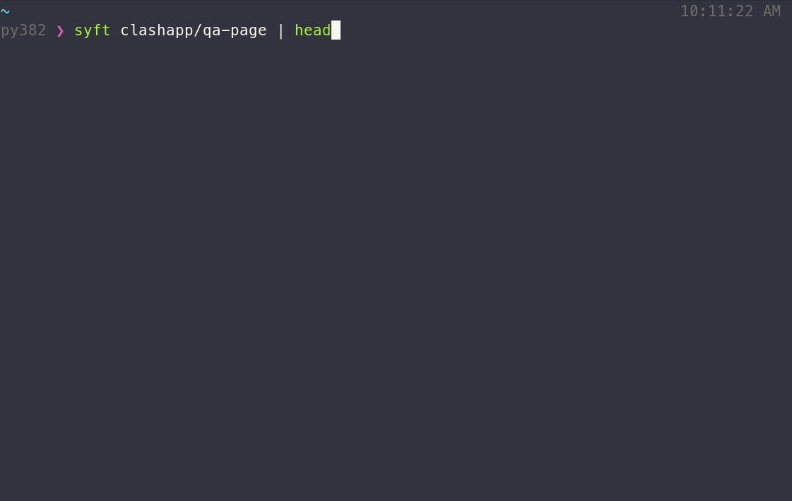

# syft

[](https://circleci.com/gh/anchore/syft)
[](https://goreportcard.com/report/github.com/anchore/syft)
[](https://github.com/anchore/syft/releases/latest)
[](https://github.com/anchore/syft/blob/main/LICENSE)

A CLI tool and go library for generating a Software Bill of Materials (SBOM) from container images and filesystems.



**Features**
- Catalog container images and filesystems to discover packages and libraries.
- Supports packages and libraries from various ecosystems (APK, DEB, RPM, Ruby Bundles, Python Wheel/Egg/requirements.txt, JavaScript NPM/Yarn, Java JAR/EAR/WAR, Jenkins plugins JPI/HPI, Go modules)
- Linux distribution identification (supports Alpine, BusyBox, CentOS/RedHat, Debian/Ubuntu flavored distributions)

> :warning: **This is pre-release software** and it may not work as expected. If you encounter an issue, please [let us know using the issue tracker](https://github.com/anchore/syft/issues).

## Getting started

To generate an SBOM for an image:
```
syft <image>
```

The above output includes only software that is visible in the container (i.e., the squashed representation of the image).
To include software from all image layers in the SBOM, regardless of its presence in the final image, provide `--scope all-layers`:

```
syft <image> --scope all-layers
```

Syft can generate a SBOM from a variety of sources:
```
# catalog a docker image tar (from the result of "docker image save ... -o image.tar" command)
syft docker-archive://path/to/image.tar

# catalog a directory
syft dir://path/to/dir
```

By default Syft shows a summary table, however, more detailed `text` and `json` formats are also available.
```
syft <image> -o json
syft <image> -o text
```

## Installation

**Recommended**
```bash
# install the latest version to /usr/local/bin
curl -sSfL https://raw.githubusercontent.com/anchore/syft/main/install.sh | sh -s -- -b /usr/local/bin

# install a specific version into a specific dir
curl -sSfL https://raw.githubusercontent.com/anchore/syft/main/install.sh | sh -s <RELEASE_VERSION> -b <SOME_BIN_PATH>
```

**macOS**
```bash
brew tap anchore/syft
brew install syft
```

You may experience a "macOS cannot verify app is free from malware" error upon running Syft because it is not yet signed and notarized. You can override this using `xattr`.
```bash
xattr -rd com.apple.quarantine syft
```

## Configuration

Configuration search paths:

- `.syft.yaml`
- `.syft/config.yaml`
- `~/.syft.yaml`
- `<XDG_CONFIG_HOME>/syft/config.yaml`

Configuration options (example values are the default):

```yaml
# same as -o ; the output format of the SBOM report (options: table, text, json)
output: "table"

# same as -s ; the search space to look for packages (options: all-layers, squashed)
scope: "squashed"

# same as -q ; suppress all output (except for the SBOM report)
quiet: false

log:
  # use structured logging
  structured: false

  # the log level; note: detailed logging suppress the ETUI
  level: "error"

  # location to write the log file (default is not to have a log file)
  file: ""

# enable/disable checking for application updates on startup
check-for-app-update: true
```

## Future plans

The following areas of potential development are currently being investigated:
- Add CycloneDX to list of output formats
- Establish a stable interchange format w/Grype
