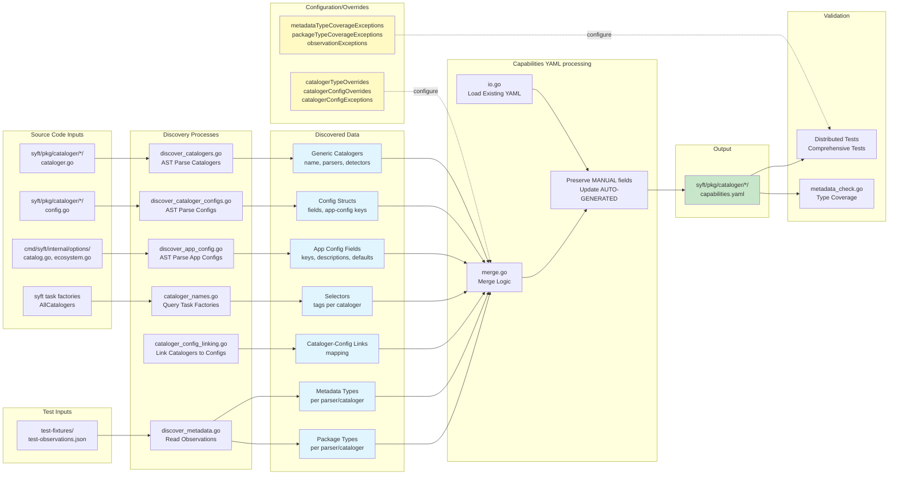

# Capabilities Generation System

This internal tool is responsible for:
- partially generating the `syft/pkg/cataloger/*/capabilities.yaml` ecosystem files, which document what capabilities each cataloger in syft has
- running completeness / consistency tests of the claims from capability YAML files against actual test observations

Syft has dozens of catalogers across many ecosystems. Each cataloger has different capabilities, such as:
- Some provide license information, others don't
- Some detect transitive dependencies, others only direct
- Some capabilities depend on configuration

The capability YAML files (located alongside cataloger source code) contain all of these capability claims, organized by ecosystem.

The `capabilities` generation system itself:
1. **Discovers** cataloger information from source code using AST parsing
2. **Extracts** metadata about parsers, detectors, and configuration from code and tests
3. **Merges** discovered information with manually-maintained capability documentation
4. **Validates** that the generated document is complete and in sync with the codebase

**Why do this?** 
The short answer is to provide a foundation for the OSS documentation, where the source of truth for facts about the capabilities of Syft can be derived from verifiable claims from the tool itself.


## Quick Start

**To regenerate capability YAML files after code changes:**
```bash
make generate-capabilities
```

This will:
- Run unit tests under ./syft/pkg... to gather up-to-date cataloger behavior
- Regenerate code that describes cataloger capabilities
- Run completeness tests against the newly generated code to ensure all capability YAML claims are consistent with test observations

If you have made cataloger code changes you may see completeness tests fail, that's ok!
That only means that you need to manually update the capability YAML files that were generated.

## Data Flow



1. **Cataloger Discovery**: AST parser walks `syft/pkg/cataloger/` to find `generic.NewCataloger()` calls and extract parser information
2. **Cataloger Config Discovery**: AST parser finds config structs and extracts fields with `// app-config:` annotations
3. **App Config Discovery**: AST parser extracts ecosystem configurations from options package, including descriptions and defaults
4. **Metadata Discovery**: JSON reader loads test observations that record what metadata/package types each parser produces
5. **Linking**: AST analyzer connects catalogers to their config structs by examining constructor parameters
6. **Merge**: Discovered data combines with existing YAML, preserving all manually-maintained capability sections
7. **Validation**: Comprehensive tests ensure the output is complete and synchronized with codebase

## The Capability YAML Files

### Purpose

The `syft/pkg/cataloger/*/capabilities.yaml` files are the canonical documentation of:
- Every cataloger in syft
- What files/patterns each cataloger detects
- What metadata and package types each cataloger produces
- What capabilities each cataloger has (licenses, dependencies, etc.)
- How configuration affects these capabilities

### Structure

Each ecosystem has its own file (e.g., `syft/pkg/cataloger/golang/capabilities.yaml`, `syft/pkg/cataloger/python/capabilities.yaml`):

```yaml
# syft/pkg/cataloger/golang/capabilities.yaml - Cataloger capabilities for the golang ecosystem

configs:  # AUTO-GENERATED - config structs for this ecosystem
  golang.CatalogerConfig:
    fields:
      - key: SearchLocalModCacheLicenses
        description: SearchLocalModCacheLicenses enables...
        app_key: golang.search-local-mod-cache-licenses

catalogers:  # Mixed AUTO-GENERATED structure, MANUAL capabilities
  - ecosystem: golang            # MANUAL
    name: go-module-cataloger    # AUTO-GENERATED
    type: generic                # AUTO-GENERATED
    source:                      # AUTO-GENERATED
      file: syft/pkg/cataloger/golang/cataloger.go
      function: NewGoModuleBinaryCataloger
    config: golang.CatalogerConfig  # AUTO-GENERATED
    selectors: [go, golang, ...]    # AUTO-GENERATED
    parsers:                     # AUTO-GENERATED structure
      - function: parseGoMod     # AUTO-GENERATED
        detector:                # AUTO-GENERATED
          method: glob
          criteria: ["**/go.mod"]
        metadata_types:          # AUTO-GENERATED
          - pkg.GolangModuleEntry
        package_types:           # AUTO-GENERATED
          - go-module
        json_schema_types:       # AUTO-GENERATED
          - GolangModEntry
        capabilities:            # MANUAL - preserved across regeneration
          - name: license
            default: false
            conditions:
              - when: {SearchRemoteLicenses: true}
                value: true
                comment: fetches licenses from proxy.golang.org
          - name: dependency.depth
            default: [direct, indirect]
          - name: dependency.edges
            default: complete
```

### AUTO-GENERATED vs MANUAL Fields

#### AUTO-GENERATED Fields
These are updated on every regeneration:

**Cataloger Level:**
- `name` - cataloger identifier
- `type` - "generic" or "custom"
- `source.file` - source file path
- `source.function` - constructor function name
- `config` - linked config struct name
- `selectors` - tags from task factories

**Parser Level (generic catalogers):**
- `function` - parser function name (as used in the generic cataloger)
- `detector.method` - glob/path/mimetype
- `detector.criteria` - patterns matched
- `metadata_types` - from test-observations.json
- `package_types` - from test-observations.json
- `json_schema_types` - converted from metadata_types

**Custom Cataloger Level:**
- `metadata_types` - from test-observations.json
- `package_types` - from test-observations.json
- `json_schema_types` - converted from metadata_types

**Sections:**
- `appconfig.yaml`: contains the `application:` section with app-level config keys relevant to catalogers
- `configs:` section in each ecosystem file: config structs used by catalogers in that ecosystem

#### MANUAL Fields
These are preserved across regeneration and must be edited by hand:

- `ecosystem` - ecosystem/language identifier (cataloger level)
- `capabilities` - capability definitions with conditions
- `detectors` - for custom catalogers (except binary-classifier-cataloger)
- `conditions` on detectors - when detector is active based on config

### How Regeneration Works

When you run `go generate ./internal/capabilities`:

1. **Loads existing YAML files** from `syft/pkg/cataloger/*/capabilities.yaml` and `internal/capabilities/appconfig.yaml` into both structs (for logic) and node trees (for comment preservation)
2. **Discovers all cataloger data** from source code and tests
3. **Merges** discovered data with existing:
   - Updates AUTO-GENERATED fields
   - **Preserves** all MANUAL fields (capabilities, ecosystem, etc.)
   - Adds annotations (`# AUTO-GENERATED`, `# MANUAL`) to field comments
4. **Writes back** to `syft/pkg/cataloger/*/capabilities.yaml` using the node tree to preserve all comments
5. **Validates** the result with completeness tests

> [!NOTE]
> Don't forget to update test observation evidence with `go test ./syft/pkg/...` before regeneration.

## Generation Process

### High-Level Workflow

```
1. Discovery Phase
   ├─ Parse cataloger source code (AST)
   ├─ Find all parsers and detectors
   ├─ Read test observations for metadata types
   ├─ Discover config structs and fields
   ├─ Discover app-level configurations
   └─ Link catalogers to their configs

2. Merge Phase
   ├─ Load existing syft/pkg/cataloger/*/capabilities.yaml files
   ├─ Process each cataloger:
   │  ├─ Update AUTO-GENERATED fields
   │  └─ Preserve MANUAL fields
   ├─ Add new catalogers
   └─ Detect orphaned entries

3. Write Phase
   ├─ Group catalogers by ecosystem
   ├─ Update YAML node trees per ecosystem
   ├─ Add field annotations
   └─ Write to syft/pkg/cataloger/*/capabilities.yaml and appconfig.yaml

4. Validation Phase
   ├─ Check all catalogers present
   ├─ Check metadata/package type coverage
   └─ Run completeness tests
```

### Detailed Discovery Processes

#### 1. Generic Cataloger Discovery (`discover_catalogers.go`)

**What it finds:** catalogers using the `generic.NewCataloger()` pattern

**Process:**
1. Walk `syft/pkg/cataloger/` recursively for `.go` files
2. Parse each file with Go AST parser (`go/ast`, `go/parser`)
3. Find functions matching pattern: `New*Cataloger() pkg.Cataloger`
4. Within function body, find `generic.NewCataloger(name, ...)` call
5. Extract cataloger name from first argument
6. Find all chained `WithParserBy*()` calls:
   ```go
   generic.NewCataloger("my-cataloger").
       WithParserByGlobs(parseMyFormat, "**/*.myformat").
       WithParserByMimeTypes(parseMyBinary, "application/x-mytype")
   ```
7. For each parser call:
   - Extract parser function name (e.g., `parseMyFormat`)
   - Extract detection method (Globs/Path/MimeTypes)
   - Extract criteria (patterns or mime types)
   - Resolve constant references across files if needed

**Output:** `map[string]DiscoveredCataloger` with full parser information

#### 2. Config Discovery (`discover_cataloger_configs.go`)

**What it finds:** cataloger configuration structs

**Process:**
1. Find all `.go` files in `syft/pkg/cataloger/*/`
2. Look for structs with "Config" in their name
3. For each config struct:
   - Extract struct fields
   - Look for `// app-config: key.name` annotations in field comments
   - Extract field descriptions from doc comments
4. Filter results by whitelist (only configs referenced in `pkgcataloging.Config`)

**Example source:**
```go
type CatalogerConfig struct {
    // SearchLocalModCacheLicenses enables searching for go package licenses
    // in the local GOPATH mod cache.
    // app-config: golang.search-local-mod-cache-licenses
    SearchLocalModCacheLicenses bool
}
```

**Output:** `map[string]ConfigInfo` with field details and app-config keys

#### 3. App Config Discovery (`discover_app_config.go`)

**What it finds:** application-level configuration from the options package

**Process:**
1. Parse `cmd/syft/internal/options/catalog.go` to find `Catalog` struct
2. Extract ecosystem config fields (e.g., `Golang golangConfig`)
3. For each ecosystem:
   - Find the config file (e.g., `golang.go`)
   - Parse the config struct
   - Find `DescribeFields() []FieldDescription` method
   - Extract field descriptions from the returned descriptions
   - Find `default*Config()` function and extract default values
4. Build full key paths (e.g., `golang.search-local-mod-cache-licenses`)

**Example source:**
```go
// golang.go
type golangConfig struct {
    SearchLocalModCacheLicenses bool `yaml:"search-local-mod-cache-licenses" ...`
}

func (c golangConfig) DescribeFields(opts ...options.DescribeFieldsOption) []options.FieldDescription {
    return []options.FieldDescription{
        {
            Name: "search-local-mod-cache-licenses",
            Description: "search for go package licences in the GOPATH...",
        },
    }
}
```

**Output:** `[]AppConfigField` with keys, descriptions, and defaults

#### 4. Cataloger-Config Linking (`cataloger_config_linking.go`)

**What it finds:** which config struct each cataloger uses

**Process:**
1. For each discovered cataloger, find its constructor function
2. Extract the first parameter type from the function signature
3. Filter for types that look like configs (contain "Config")
4. Build mapping: cataloger name → config struct name
5. Apply manual overrides from `catalogerConfigOverrides` map
6. Apply exceptions from `catalogerConfigExceptions` set

**Example:**
```go
// Constructor signature:
func NewGoModuleBinaryCataloger(cfg golang.CatalogerConfig) pkg.Cataloger

// Results in link:
"go-module-binary-cataloger" → "golang.CatalogerConfig"
```

**Output:** `map[string]string` (cataloger → config mapping)

#### 5. Metadata Discovery (`discover_metadata.go`)

**What it finds:** metadata types and package types each parser produces

**Process:**
1. Find all `test-fixtures/test-observations.json` files
2. Parse JSON which contains:
   ```json
   {
     "package": "golang",
     "parsers": {
       "parseGoMod": {
         "metadata_types": ["pkg.GolangModuleEntry"],
         "package_types": ["go-module"]
       }
     },
     "catalogers": {
       "linux-kernel-cataloger": {
         "metadata_types": ["pkg.LinuxKernel"],
         "package_types": ["linux-kernel"]
       }
     }
   }
   ```
3. Build index by package name and parser function
4. Apply to discovered catalogers:
   - Parser-level observations → attached to specific parsers
   - Cataloger-level observations → for custom catalogers
5. Convert metadata types to JSON schema types using `packagemetadata` registry

**Why this exists:** the AST parser can't determine what types a parser produces just by reading code. This information comes from test execution.

**Output:** populated `MetadataTypes` and `PackageTypes` on catalogers/parsers

## Input Sources

### 1. Source Code Inputs

#### Cataloger Constructors (`syft/pkg/cataloger/*/cataloger.go`)

**What's extracted:**
- Cataloger names
- Parser function names
- Detection methods (glob, path, mimetype)
- Detection criteria (patterns)

**Example:**
```go
func NewGoModuleBinaryCataloger() pkg.Cataloger {
    return generic.NewCataloger("go-module-binary-cataloger").
        WithParserByGlobs(parseGoBin, "**/go.mod").
        WithParserByMimeTypes(parseGoArchive, "application/x-archive")
}
```

#### Config Structs (`syft/pkg/cataloger/*/config.go`)

**What's extracted:**
- Config struct fields
- Field types
- Field descriptions from comments
- App-config key mappings from annotations

**Example:**
```go
type CatalogerConfig struct {
    // SearchRemoteLicenses enables downloading go package licenses from the upstream
    // go proxy (typically proxy.golang.org).
    // app-config: golang.search-remote-licenses
    SearchRemoteLicenses bool

    // LocalModCacheDir specifies the location of the local go module cache directory.
    // When not set, syft will attempt to discover the GOPATH env or default to $HOME/go.
    // app-config: golang.local-mod-cache-dir
    LocalModCacheDir string
}
```

#### Options Package (`cmd/syft/internal/options/`)

**What's extracted:**
- Ecosystem config structs
- App-level configuration keys
- Field descriptions from `DescribeFields()` methods
- Default values from `default*Config()` functions

**Example:**
```go
// catalog.go
type Catalog struct {
    Golang golangConfig `yaml:"golang" json:"golang" mapstructure:"golang"`
}

// golang.go
func (c golangConfig) DescribeFields(opts ...options.DescribeFieldsOption) []options.FieldDescription {
    return []options.FieldDescription{
        {
            Name: "search-remote-licenses",
            Description: "search for go package licences by retrieving the package from a network proxy",
        },
    }
}
```

### 2. Test-Driven Inputs

#### test-observations.json Files

**Location:** `syft/pkg/cataloger/*/test-fixtures/test-observations.json`

**Purpose:** records what metadata and package types each parser produces during test execution

**How they're generated:** automatically by the `pkgtest.CatalogTester` helpers when tests run

**Example test code:**
```go
func TestGoModuleCataloger(t *testing.T) {
    tester := NewGoModuleBinaryCataloger()

    pkgtest.NewCatalogTester().
        FromDirectory(t, "test-fixtures/go-module-fixture").
        TestCataloger(t, tester)  // Auto-writes observations on first run
}
```

**Example observations file:**
```json
{
  "package": "golang",
  "parsers": {
    "parseGoMod": {
      "metadata_types": ["pkg.GolangModuleEntry"],
      "package_types": ["go-module"]
    },
    "parseGoSum": {
      "metadata_types": ["pkg.GolangModuleEntry"],
      "package_types": ["go-module"]
    }
  }
}
```

**Why this exists:**
- Metadata types can't be determined from AST parsing alone
- Ensures tests use the pkgtest helpers (enforced by `TestAllCatalogers HaveObservations`)
- Provides test coverage visibility

### 3. Syft Runtime Inputs

#### Task Factories (`allPackageCatalogerInfo()`)

**What's extracted:**
- Canonical list of all catalogers (ensures sync with binary)
- Selectors (tags) for each cataloger

**Example:**
```go
info := cataloger.CatalogerInfo{
    Name: "go-module-binary-cataloger",
    Selectors: []string{"go", "golang", "binary", "language", "package"},
}
```

### 4. Global Configuration Variables

#### Merge Logic Overrides (`merge.go`)

```go
// catalogerTypeOverrides forces a specific cataloger type when discovery gets it wrong
var catalogerTypeOverrides = map[string]string{
    "java-archive-cataloger": "custom",  // technically generic but treated as custom
}

// catalogerConfigExceptions lists catalogers that should NOT have config linked
var catalogerConfigExceptions = strset.New(
    "binary-classifier-cataloger",
)

// catalogerConfigOverrides manually specifies config when linking fails
var catalogerConfigOverrides = map[string]string{
    "dotnet-portable-executable-cataloger": "dotnet.CatalogerConfig",
    "nix-store-cataloger":                  "nix.Config",
}
```

**When to update:**
- Add to `catalogerTypeOverrides` when a cataloger's type is misdetected
- Add to `catalogerConfigExceptions` when a cataloger shouldn't have config
- Add to `catalogerConfigOverrides` when automatic config linking fails

#### Completeness Test Configuration (distributed across `*_test.go` files)

```go
// requireParserObservations controls observation validation strictness
// - true: fail if ANY parser is missing observations (strict)
// - false: only check custom catalogers (lenient, current mode)
const requireParserObservations = false

// metadataTypeCoverageExceptions lists metadata types allowed to not be documented
var metadataTypeCoverageExceptions = strset.New(
    reflect.TypeOf(pkg.MicrosoftKbPatch{}).Name(),
)

// packageTypeCoverageExceptions lists package types allowed to not be documented
var packageTypeCoverageExceptions = strset.New(
    string(pkg.JenkinsPluginPkg),
    string(pkg.KbPkg),
)

// observationExceptions maps cataloger/parser names to observation types to skip
// - nil value: skip ALL observation checks for this cataloger/parser
// - set value: skip only specified observation types
var observationExceptions = map[string]*strset.Set{
    "graalvm-native-image-cataloger": nil,  // skip all checks
    "linux-kernel-cataloger": strset.New("relationships"),  // skip only relationships
}
```

**When to update:**
- Add to exceptions when a type is intentionally not documented
- Add to `observationExceptions` when a cataloger lacks reliable test fixtures
- Set `requireParserObservations = true` when ready to enforce full parser coverage

## Completeness Tests

### Purpose

Completeness tests ensure capability YAML files stay in perfect sync with the codebase. These tests catch:
- New catalogers that haven't been documented
- Orphaned cataloger entries (cataloger was removed but YAML wasn't updated)
- Missing metadata/package type documentation
- Invalid capability field references
- Catalogers not using test helpers

### Test Organization

Completeness tests are distributed across multiple packages:
- `internal/capabilities/`
- `internal/capabilities/internal/`
- `internal/capabilities/generate/`

**Guard Clause**: All completeness tests are protected by `checkCompletenessTestsEnabled()` which checks the `SYFT_ENABLE_COMPLETENESS_TESTS=true` environment variable.

**Why the guard?** There's a chicken-and-egg problem:
1. Package cataloger tests (`go test ./syft/pkg/...`) must run first to generate observation JSON files
2. Those observation JSONs are then used by the capabilities generation and completeness tests
3. Therefore, completeness tests cannot run as normal unit tests - they must run after the pkg tests and generation steps

### Test Categories

#### 1. Synchronization Tests

**`TestCatalogersInSync`**
- Ensures all catalogers from `syft cataloger list` appear in YAML
- Ensures all catalogers in YAML exist in the binary
- Ensures all capabilities sections are filled (no TODOs/nulls)

**Failure means:** you added/removed a cataloger but didn't regenerate the capability YAML files

**Fix:** run `go generate ./internal/capabilities`

---

**`TestCapabilitiesAreUpToDate`**
- Runs only in CI
- Ensures regeneration succeeds
- Ensures generated files have no uncommitted changes

**Failure means:** capability YAML files weren't regenerated after code changes

**Fix:** run `go generate ./internal/capabilities` and commit changes

#### 2. Coverage Tests

**`TestPackageTypeCoverage`**
- Ensures all types in `pkg.AllPkgs` are documented in some cataloger
- Allows exceptions via `packageTypeCoverageExceptions`

**Failure means:** you added a new package type but no cataloger documents it

**Fix:** either add a cataloger entry or add to exceptions if intentionally not supported

---

**`TestMetadataTypeCoverage`**
- Ensures all types in `packagemetadata.AllTypes()` are documented
- Allows exceptions via `metadataTypeCoverageExceptions`

**Failure means:** you added a new metadata type but no cataloger produces it

**Fix:** either add metadata_types to a cataloger or add to exceptions

---

**`TestMetadataTypesHaveJSONSchemaTypes`**
- Ensures metadata_types and json_schema_types are synchronized
- Validates every metadata type has a corresponding json_schema_type with correct conversion
- Checks both cataloger-level and parser-level types

**Failure means:** metadata_types and json_schema_types are out of sync

**Fix:** run `go generate ./internal/capabilities` to regenerate synchronized types

#### 3. Structure Tests

**`TestCatalogerStructure`**
- Validates generic vs custom cataloger structure rules:
  - Generic catalogers must have parsers, no cataloger-level capabilities
  - Custom catalogers must have detectors and cataloger-level capabilities
- Ensures ecosystem is always set

**Failure means:** cataloger structure doesn't follow conventions

**Fix:** correct the cataloger structure in the appropriate `syft/pkg/cataloger/*/capabilities.yaml` file

---

**`TestCatalogerDataQuality`**
- Checks for duplicate cataloger names
- Validates detector formats for custom catalogers
- Checks for duplicate parser functions within catalogers

**Failure means:** data integrity issue in capability YAML files

**Fix:** remove duplicates or fix detector definitions

#### 4. Config Tests

**`TestConfigCompleteness`**
- Ensures all configs in the `configs:` section are referenced by a cataloger
- Ensures all cataloger config references exist
- Ensures all app-key references exist in `application:` section

**Failure means:** orphaned config or broken reference

**Fix:** remove unused configs or add missing entries

---

**`TestAppConfigFieldsHaveDescriptions`**
- Ensures all application config fields have descriptions

**Failure means:** missing `DescribeFields()` entry

**Fix:** add description in the ecosystem's `DescribeFields()` method

---

**`TestAppConfigKeyFormat`**
- Validates config keys follow format: `ecosystem.field-name`
- Ensures kebab-case (no underscores or spaces)

**Failure means:** malformed config key

**Fix:** rename the config key to follow conventions

#### 5. Capability Tests

**`TestCapabilityConfigFieldReferences`**
- Validates that config fields referenced in capability conditions actually exist
- Checks both cataloger-level and parser-level capabilities

**Example failure:**
```yaml
capabilities:
  - name: license
    conditions:
      - when: {NonExistentField: true}  # ← this field doesn't exist in config struct
        value: true
```

**Fix:** correct the field name to match the actual config struct

---

**`TestCapabilityFieldNaming`**
- Ensures capability field names follow known patterns:
  - `license`
  - `dependency.depth`
  - `dependency.edges`
  - `dependency.kinds`
  - `package_manager.files.listing`
  - `package_manager.files.digests`
  - `package_manager.package_integrity_hash`

**Failure means:** typo in capability field name

**Fix:** correct the typo or add new field to known list

---

**`TestCapabilityValueTypes`**
- Validates capability values match expected types:
  - Boolean fields: `license`, `package_manager.*`
  - Array fields: `dependency.depth`, `dependency.kinds`
  - String fields: `dependency.edges`

**Example failure:**
```yaml
capabilities:
  - name: license
    default: "yes"  # ← should be boolean true/false
```

**Fix:** use correct type for the field

---

**`TestCapabilityEvidenceFieldReferences`**
- Validates that evidence references point to real struct fields
- Uses AST parsing to verify field paths exist

**Example:**
```yaml
capabilities:
  - name: package_manager.files.digests
    default: true
    evidence:
      - AlpmDBEntry.Files[].Digests  # ← validates this path exists
```

**Failure means:** typo in evidence reference or struct was changed

**Fix:** correct the evidence reference or update after struct changes

#### 6. Observations Test

**`TestCatalogersHaveTestObservations`**
- Ensures all custom catalogers have test observations
- Optionally checks parsers (controlled by `requireParserObservations`)
- Allows exceptions via `observationExceptions`

**Failure means:** cataloger tests aren't using pkgtest helpers

**Fix:** update tests to use `pkgtest.CatalogTester`:
```go
pkgtest.NewCatalogTester().
    FromDirectory(t, "test-fixtures/my-fixture").
    TestCataloger(t, myCataloger)
```

### How to Fix Test Failures

#### General Approach
1. **Read the test error message** - it usually tells you exactly what's wrong
2. **Check if regeneration needed** - most failures fixed by: `go generate ./internal/capabilities`
3. **Check for code/test changes** - did you add/modify a cataloger?
4. **Consider exceptions** - is this intentionally unsupported?

#### Common Failures and Fixes

| Failure | Most Likely Cause | Fix |
|---------|------------------|-----|
| Cataloger not in YAML | Added new cataloger | Regenerate |
| Orphaned YAML entry | Removed cataloger | Regenerate |
| Missing metadata type | Added type but no test observations | Add pkgtest usage or exception |
| Missing observations | Test not using pkgtest | Update test to use `CatalogTester` |
| Config field reference | Typo in capability condition | Fix field name in capability YAML |
| Incomplete capabilities | Missing capability definition | Add capabilities section to capability YAML |

## Manual Maintenance

### What Requires Manual Editing

These fields in capability YAML files are **MANUAL** and must be maintained by hand:

#### 1. Ecosystem Field (Cataloger Level)
```yaml
catalogers:
  - ecosystem: golang  # MANUAL - identify the ecosystem
```

**Guidelines:** use the ecosystem/language name (golang, python, java, rust, etc.)

#### 2. Capabilities Sections

**For Generic Catalogers** (parser level):
```yaml
parsers:
  - function: parseGoMod
    capabilities:  # MANUAL
      - name: license
        default: false
        conditions:
          - when: {SearchRemoteLicenses: true}
            value: true
            comment: fetches licenses from proxy.golang.org
      - name: dependency.depth
        default: [direct, indirect]
      - name: dependency.edges
        default: complete
```

**For Custom Catalogers** (cataloger level):
```yaml
catalogers:
  - name: linux-kernel-cataloger
    type: custom
    capabilities:  # MANUAL
      - name: license
        default: true
```

#### 3. Detectors for Custom Catalogers

**For most custom catalogers:**
```yaml
detectors:  # MANUAL
  - method: glob
    criteria:
      - '**/lib/modules/**/modules.builtin'
    comment: kernel modules directory
```

**Exception:** `binary-classifier-cataloger` has AUTO-GENERATED detectors extracted from source

#### 4. Detector Conditions

when a detector should only be active with certain configuration:
```yaml
detectors:
  - method: glob
    criteria: ['**/*.zip']
    conditions:  # MANUAL
      - when: {IncludeZipFiles: true}
        comment: ZIP detection requires explicit config
```

### Capabilities Format and Guidelines

#### Standard Capability Fields

**Boolean Fields:**
```yaml
- name: license
  default: true  # always available
  # OR
  default: false  # never available
  # OR
  default: false
  conditions:
    - when: {SearchRemoteLicenses: true}
      value: true
      comment: requires network access to fetch licenses
```

**Array Fields (dependency.depth):**
```yaml
- name: dependency.depth
  default: [direct]              # only immediate dependencies
  # OR
  default: [direct, indirect]    # full transitive closure
  # OR
  default: []                    # no dependency information
```

**String Fields (dependency.edges):**
```yaml
- name: dependency.edges
  default: ""        # dependencies found but no edges between them
  # OR
  default: flat      # single level of dependencies with edges to root only
  # OR
  default: reduced   # transitive reduction (redundant edges removed)
  # OR
  default: complete  # all relationships with accurate direct/indirect edges
```

**Array Fields (dependency.kinds):**
```yaml
- name: dependency.kinds
  default: [runtime]                    # production dependencies only
  # OR
  default: [runtime, dev]               # production and development
  # OR
  default: [runtime, dev, build, test]  # all dependency types
```

#### Using Conditions

Conditions allow capabilities to vary based on configuration values:

```yaml
capabilities:
  - name: license
    default: false
    conditions:
      - when: {SearchLocalModCacheLicenses: true}
        value: true
        comment: searches for licenses in GOPATH mod cache
      - when: {SearchRemoteLicenses: true}
        value: true
        comment: fetches licenses from proxy.golang.org
    comment: license scanning requires configuration
```

**Rules:**
- Conditions are evaluated in array order (first match wins)
- Multiple fields WITHIN a `when` clause use AND logic (all must match)
- Multiple conditions in the array use OR logic (first matching condition)
- If no conditions match, the `default` value is used

#### Adding Evidence

evidence documents which struct fields provide the capability:

```yaml
- name: package_manager.files.listing
  default: true
  evidence:
    - AlpmDBEntry.Files
  comment: file listings stored in Files array
```

**For nested fields:**
```yaml
evidence:
  - CondaMetaPackage.PathsData.Paths
```

**For array element fields:**
```yaml
evidence:
  - AlpmDBEntry.Files[].Digests
```

### Best Practices

1. **Be specific in comments:** explain WHY, not just WHAT
2. **Document conditions clearly:** explain what configuration enables the capability
3. **Use evidence references:** helps verify capabilities are accurate
4. **Test after edits:** run `SYFT_ENABLE_COMPLETENESS_TESTS=true go test ./internal/capabilities/...` to validate

## Development Workflows

### Adding a New Cataloger

#### If Using `generic.NewCataloger()`:

**What happens automatically:**
1. Generator discovers the cataloger via AST parsing
2. Extracts parsers, detectors, and patterns
3. Adds entry to the appropriate `syft/pkg/cataloger/*/capabilities.yaml` file
4. Links to config (if constructor has config parameter)
5. Extracts metadata types from test-observations.json (if test uses pkgtest)

**What you must do manually:**
1. Set the `ecosystem` field in the capability YAML file
2. Add `capabilities` sections to each parser
3. Run `go generate ./internal/capabilities`
4. Commit the updated capability YAML file

**Example workflow:**
```bash
# 1. Write cataloger code
vim syft/pkg/cataloger/mynew/cataloger.go

# 2. Write tests using pkgtest (generates observations)
vim syft/pkg/cataloger/mynew/cataloger_test.go

# 3. Run tests to generate observations
go test ./syft/pkg/cataloger/mynew

# 4. Regenerate capability YAML files
go generate ./internal/capabilities

# 5. Edit the capability file manually
vim syft/pkg/cataloger/mynew/capabilities.yaml
# - Set ecosystem field
# - Add capabilities sections

# 6. Validate
SYFT_ENABLE_COMPLETENESS_TESTS=true go test ./internal/capabilities/...

# 7. Commit
git add syft/pkg/cataloger/mynew/capabilities.yaml
git add syft/pkg/cataloger/mynew/test-fixtures/test-observations.json
git commit
```

#### If Writing a Custom Cataloger:

**What happens automatically:**
1. Generator creates entry with name and type
2. Extracts metadata types from test-observations.json

**What you must do manually:**
1. Set `ecosystem`
2. Add `detectors` array with detection methods
3. Add `capabilities` section (cataloger level, not parser level)
4. Run `go generate ./internal/capabilities`

### Modifying an Existing Cataloger

#### If Changing Parser Detection Patterns:

**Impact:** AUTO-GENERATED field, automatically updated

**Workflow:**
```bash
# 1. Change the code
vim syft/pkg/cataloger/something/cataloger.go

# 2. Regenerate
go generate ./internal/capabilities

# 3. Review changes
git diff syft/pkg/cataloger/*/capabilities.yaml

# 4. Commit
git add syft/pkg/cataloger/*/capabilities.yaml
git commit
```

#### If Changing Metadata Type:

**Impact:** AUTO-GENERATED field, updated via test observations

**Workflow:**
```bash
# 1. Change the code
vim syft/pkg/cataloger/something/parser.go

# 2. Update tests (if needed)
vim syft/pkg/cataloger/something/parser_test.go

# 3. Run tests to update observations
go test ./syft/pkg/cataloger/something

# 4. Regenerate
go generate ./internal/capabilities

# 5. Commit
git add syft/pkg/cataloger/*/capabilities.yaml
git add syft/pkg/cataloger/something/test-fixtures/test-observations.json
git commit
```

#### If Changing Capabilities:

**Impact:** MANUAL field, preserved across regeneration

**Workflow:**
```bash
# 1. Edit the capability file directly
vim syft/pkg/cataloger/something/capabilities.yaml

# 2. Validate
SYFT_ENABLE_COMPLETENESS_TESTS=true go test ./internal/capabilities/...

# 3. Commit
git commit syft/pkg/cataloger/something/capabilities.yaml
```

### Adding New Capability Fields

if you need to add a completely new capability field (e.g., `package_manager.build_tool_info`):

**Steps:**
1. Add field name to known fields in the appropriate test file
2. Add value type validation to the validation logic
3. Update file header documentation in capability YAML files
4. Add the field to relevant catalogers in the appropriate `syft/pkg/cataloger/*/capabilities.yaml` files
5. Update any runtime code that consumes capabilities

### When to Update Exceptions

#### Add to `catalogerTypeOverrides`:
- Discovery incorrectly classifies a cataloger's type
- Example: cataloger uses generic framework but behaves like custom

#### Add to `catalogerConfigExceptions`:
- Cataloger should not have config linked
- Example: simple catalogers with no configuration

#### Add to `catalogerConfigOverrides`:
- Automatic config linking fails
- Cataloger in a subpackage or unusual structure
- Example: dotnet catalogers split across multiple packages

#### Add to `metadataTypeCoverageExceptions`:
- Metadata type is deprecated or intentionally unused
- Example: `MicrosoftKbPatch` (special case type)

#### Add to `packageTypeCoverageExceptions`:
- Package type is deprecated or special case
- Example: `JenkinsPluginPkg`, `KbPkg`

#### Add to `observationExceptions`:
- Cataloger lacks reliable test fixtures (e.g., requires specific binaries)
- Cataloger produces relationships but they're not standard dependencies
- Example: `graalvm-native-image-cataloger` (requires native images)

## File Inventory

### Core Generation (`internal/capabilities/generate/`)

- **`main.go`**: entry point, orchestrates regeneration, prints status messages
- **`merge.go`**: core merging logic, preserves manual sections while updating auto-generated
- **`io.go`**: YAML reading/writing with comment preservation using gopkg.in/yaml.v3

### Discovery (`internal/capabilities/generate/`)

- **`discover_catalogers.go`**: AST parsing to discover generic catalogers and parsers from source code
- **`discover_cataloger_configs.go`**: AST parsing to discover cataloger config structs
- **`discover_app_config.go`**: AST parsing to discover application-level config from options package
- **`cataloger_config_linking.go`**: links catalogers to config structs by analyzing constructors
- **`discover_metadata.go`**: reads test-observations.json files to get metadata/package types

### Shared Utilities (`internal/capabilities/internal/`)

- **`paths.go`**: single source of truth for all capability file paths
- **`load_capabilities.go`**: loading and parsing capability YAML files
- **`cataloger_names.go`**: helper to get all cataloger names from syft task factories
- **`repo_root.go`**: helpers to find the repository root

### Validation

- **`metadata_check.go`**: validates metadata and package type coverage

### Completeness Tests

Tests are distributed across packages with `checkCompletenessTestsEnabled()` guard:
- `internal/capabilities/*_test.go`
- `internal/capabilities/internal/*_test.go`
- `internal/capabilities/generate/*_test.go`

### Unit Tests

- **`discover_catalogers_test.go`**: tests for cataloger discovery
- **`discover_cataloger_configs_test.go`**: tests for config discovery
- **`cataloger_config_linking_test.go`**: tests for config linking
- **`merge_test.go`**: tests for merge logic
- **`io_test.go`**: tests for YAML I/O

## Troubleshooting

### "Cataloger X not found in capability YAML"

**Cause:** you added a new cataloger but didn't regenerate the capability YAML files

**Fix:**
```bash
go generate ./internal/capabilities
```

### "Cataloger X in YAML but not in binary"

**Cause:** you removed a cataloger but didn't regenerate

**Fix:**
```bash
go generate ./internal/capabilities
# Review the diff - the cataloger entry should be removed
```

### "Metadata type X not represented in any cataloger"

**Cause:** you added a new metadata type but:
- No cataloger produces it yet, OR
- Tests don't use pkgtest helpers (so observations aren't generated)

**Fix Option 1 - Add test observations:**
```go
// Update test to use pkgtest
pkgtest.NewCatalogTester().
    FromDirectory(t, "test-fixtures/my-fixture").
    TestCataloger(t, myCataloger)

// Run tests
go test ./syft/pkg/cataloger/mypackage

// Regenerate
go generate ./internal/capabilities
```

**Fix Option 2 - Add exception (if intentionally unused):**
```go
// in metadata_check.go
var metadataTypeExceptions = map[string]bool{
    "pkg.MyNewType": true,
}
```

### "Parser X has no test observations"

**Cause:** test doesn't use pkgtest helpers

**Fix:**
```go
// Before:
func TestMyParser(t *testing.T) {
    // manual test code
}

// After:
func TestMyParser(t *testing.T) {
    cataloger := NewMyCataloger()
    pkgtest.NewCatalogTester().
        FromDirectory(t, "test-fixtures/my-fixture").
        TestCataloger(t, cataloger)
}
```

### "Config field X not found in struct Y"

**Cause:** capability condition references a non-existent config field

**Fix:** edit the capability YAML file and correct the field name:
```yaml
# Before:
conditions:
  - when: {SerachRemoteLicenses: true}  # typo!

# After:
conditions:
  - when: {SearchRemoteLicenses: true}
```

### "Evidence field X.Y not found in struct X"

**Cause:**
- Typo in evidence reference, OR
- Struct was refactored and field moved/renamed

**Fix:** edit the capability YAML file and correct the evidence reference:
```yaml
# Before:
evidence:
  - AlpmDBEntry.FileListing  # wrong field name

# After:
evidence:
  - AlpmDBEntry.Files
```

### "Capability YAML files have uncommitted changes after regeneration"

**Cause:** capability YAML files are out of date (usually caught in CI)

**Fix:**
```bash
go generate ./internal/capabilities
git add syft/pkg/cataloger/*/capabilities.yaml
git commit -m "chore: regenerate capabilities"
```

### Generator Fails with "struct X not found"

**Cause:** config linking trying to link to a non-existent struct

**Fix Option 1 - Add override:**
```go
// merge.go
var catalogerConfigOverrides = map[string]string{
    "my-cataloger": "mypackage.MyConfig",
}
```

**Fix Option 2 - Add exception:**
```go
// merge.go
var catalogerConfigExceptions = strset.New(
    "my-cataloger",  // doesn't use config
)
```

### "Parser capabilities must be defined"

**Cause:** parser in capability YAML file has no capabilities section

**Fix:** add capabilities to the parser:
```yaml
parsers:
  - function: parseMyFormat
    capabilities:
      - name: license
        default: false
      - name: dependency.depth
        default: []
      # ... (add all required capability fields)
```

### Understanding Error Messages

most test failures include detailed guidance. Look for:
- **List of missing items:** tells you exactly what to add/remove
- **Suggestions:** usually includes the command to fix (e.g., "Run 'go generate ./internal/capabilities'")
- **File locations:** tells you which file to edit

**General debugging approach:**
1. Read the full error message
2. Check if it's fixed by regeneration
3. Check for recent code/test changes
4. Consider if it should be an exception
5. Ask for help if still stuck (include full error message)

---

## Questions or Issues?

if you encounter problems not covered here:
1. Check test error messages (they're usually quite helpful)
2. Look at recent commits for examples of similar changes
3. Ask in the team chat with the full error message
