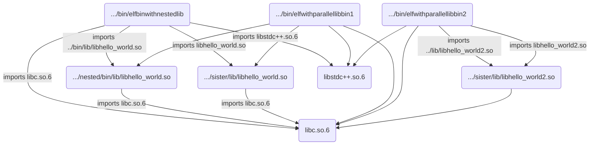
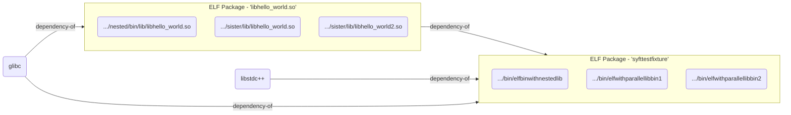

## Summary
This image illustrates a few examples of how ELF executables can be assembled and illustrated in an SBOM.

### Example 1: elf-test-fixtures/elfbinwithsisterlib
This example builds two binaries with srcs found in elfsrc1 and elfsrc2.


- 3 separate libs, two with the same name, 1 different, all different locations, but same output when:


```
objdump -s -j .note.package  /usr/local/bin/elftests/elfbinwithnestedlib/bin/lib/libhello_world.so

/usr/local/bin/elftests/elfbinwithnestedlib/bin/lib/libhello_world.so:     file format elf64-littleaarch64

Contents of section .note.package:
 0000 7b227479 7065223a 20227465 73746669  {"type": "testfi
 0010 78747572 65222c22 6c696365 6e736522  xture","license"
 0020 3a224d49 54222c22 636f6d6d 6974223a  :"MIT","commit":
 0030 22353533 34633338 64306666 65663961  "5534c38d0ffef9a
 0040 33663833 31353466 30623761 37666236  3f83154f0b7a7fb6
 0050 61623061 62366462 62222c22 736f7572  ab0ab6dbb","sour
 0060 63655265 706f223a 22687474 70733a2f  ceRepo":"https:/
 0070 2f676974 6875622e 636f6d2f 736f6d65  /github.com/some
 0080 6f6e652f 736f6d65 77686572 652e6769  one/somewhere.gi
 0090 74222c22 76656e64 6f72223a 20227379  t","vendor": "sy
 00a0 6674222c 22737973 74656d22 3a202273  ft","system": "s
 00b0 79667473 7973222c 226e616d 65223a20  yftsys","name":
 00c0 226c6962 68656c6c 6f5f776f 726c642e  "libhello_world.
 00d0 736f222c 22766572 73696f6e 223a2022  so","version": "
 00e0 302e3031 222c2270 75726c22 3a202270  0.01","purl": "p
 00f0 6b673a67 656e6572 69632f73 79667473  kg:generic/syfts
 0100 79732f73 79667474 65737466 69787475  ys/syfttestfixtu
 0110 72654030 2e303122 2c226370 65223a20  re@0.01","cpe":
 0120 22637065 3a2f6f3a 73796674 3a737966  "cpe:/o:syft:syf
 0130 74737973 5f746573 74666978 74757265  tsys_testfixture
 0140 5f737966 74746573 74666978 74757265  _syfttestfixture
 0150 3a302e30 31227d0a                    :0.01"}.
```

### Binaries
```
/usr/local/bin/elftests/elfbinwithnestedlib/bin/elfbinwithnestedlib
/usr/local/bin/elftests/elfbinwithsisterlib/bin/elfwithparallellibbin2
/usr/local/bin/elftests/elfbinwithsisterlib/bin/elfwithparallellibbin1
```

#### Libraries
```
/usr/local/bin/elftests/elfbinwithnestedlib/bin/lib/libhello_world.so
/usr/local/bin/elftests/elfbinwithsisterlib/lib/libhello_world.so
/usr/local/bin/elftests/elfbinwithsisterlib/lib/libhello_world2.so
```

#### Binaries related to Libraries
The resulting SBOM shoult show the following relationships:
```
elfbinwithnestedlib -> libhello_world.so
elfwithparallellibbin2 -> libhello_world.so
elfwithparallellibbin1 -> libhello_world2.so
```
#### Desired State
We want to drop the package to file relationships and instead do package to package

Single relationship
ElfPackage `libhellp_world.so` -> ElfPackage `syfttestfixture` library

Also relationship between the binaries and the rpm packages transitive dependencies that come from the library

#### Actual state


#### Desired relationships

